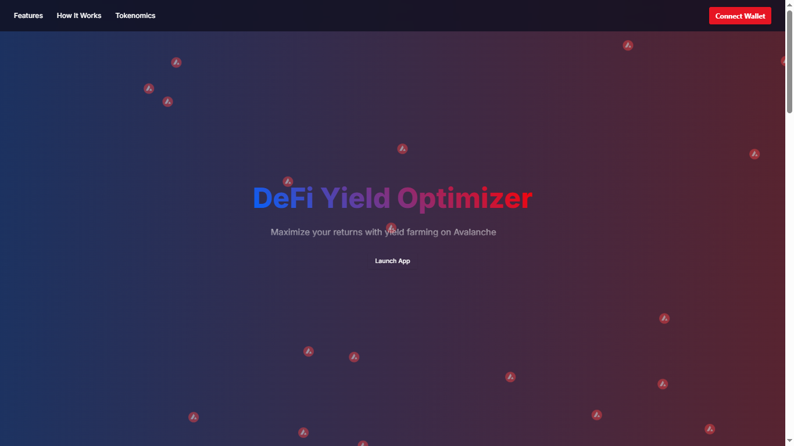

# Defi Yield Optimizer

### Yield Tokenization Contract Address Deployed on Avalanche Fuji Testnet: 0xA7d3EBe45dbE275756341841B8f30A0C4FBa1439
### Snowtrace URL: https://testnet.snowtrace.io/address/0xA7d3EBe45dbE275756341841B8f30A0C4FBa1439
### Governance Contract Address Deployed on Avalanche Fuji Testnet: 0x84D8779e6f128879F99Ea26a2829318867c87721

Managing decentralized finance (DeFi) investments is becoming increasingly complex as the ecosystem grows. With an ever-expanding array of protocols offering varying yields, users face significant challenges in optimizing returns while minimizing risks. The need for constant monitoring and manual reallocation of funds can be both time-consuming and daunting, particularly for newcomers and even seasoned investors.

## Solution:

Our DeFi Yield Optimizer addresses these challenges by automating the process of yield optimization across multiple protocols. This innovative solution simplifies the investment journey, making DeFi more accessible and efficient for all users, from beginners to experts.

## Key Features:

### 1. Yield Tokenization:

Upon depositing funds into our DeFi Yield Optimizer, users receive yTokens. These yTokens represent a proportional share of the pooled funds and the accumulated interest. The flexibility of yTokens allows users to transfer, trade, or utilize them within other DeFi applications. This tokenization provides liquidity and ease of access without requiring users to interact directly with the underlying protocols. When users choose to withdraw, their yTokens are burned, and they receive their initial deposit along with any earned yield.

### 2. Governance:

Our platform embraces a decentralized governance model, empowering the community to participate in decision-making processes through governance tokens. Holders of these tokens can influence critical aspects of the platform's future, ensuring that the direction of the optimizer aligns with the collective interests of its users.

### 3. APY (Annual Percentage Yield):

The optimizer continuously scans leading DeFi protocols such as Aave, Compound, Curve, and Yearn to identify the highest APYs available. By dynamically reallocating funds to the most lucrative opportunities, we ensure users maximize their returns without needing to actively manage their investments.

### 4. Dynamic Rebalancing:

Our system employs advanced algorithms for dynamic rebalancing. It automatically reallocates funds in response to market changes, ensuring that user investments remain positioned in the most profitable opportunities. This feature eliminates the need for manual intervention, providing a seamless investment experience.

### 5. Risk Management:

To mitigate risks, our optimizer implements diversification strategies by spreading funds across multiple protocols. We collaborate with reputable auditors to ensure the security and integrity of our platform. Additionally, we offer optional insurance options to provide users with added peace of mind.

### 6. Depositing and Withdrawing:

Users can deposit funds effortlessly into the optimizer and withdraw at any time. The withdrawal process is straightforward, with users receiving their principal amount plus any accrued interest. This flexibility ensures users maintain control over their funds while benefiting from optimized yields.

### 7. Rewards:

Beyond yield optimization, our platform offers multiple incentives to enhance user engagement. Users can earn governance tokens, staking rewards, and participate in referral programs. These additional rewards create a more engaging and rewarding experience for our community.

Our DeFi Yield Optimizer provides a comprehensive solution to the complexities of DeFi investments. By automating yield optimization, offering dynamic rebalancing, and implementing robust risk management strategies, we make yield farming accessible and efficient. Users can maximize their returns with minimal effort, benefiting from the best opportunities the DeFi ecosystem has to offer.

Thank you for considering our DeFi Yield Optimizer as a valuable addition to the DeFi landscape. We look forward to transforming the way users engage with DeFi investments, making it simpler, safer, and more rewarding for everyone.